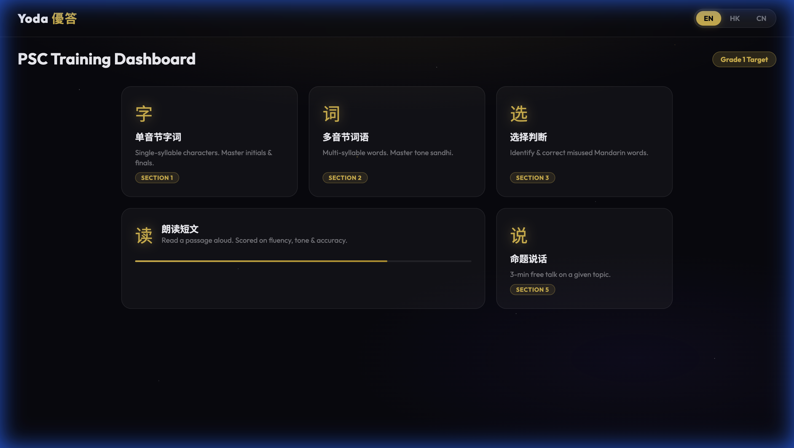

# 🧙 Yoda 優答 — GenAI Putonghua Mentor

> **您的普通話水平測試 AI 專屬教練**
> Your AI-powered real-time coach for the Putonghua Proficiency Test (PSC)


---

## 🌟 What is Yoda 優答?

Yoda 優答 is an interactive, full-stack web application designed to help users prepare for the **PSC (普通話水平測試)** — the official Putonghua (Mandarin Chinese) proficiency test required for teachers, broadcasters, and civil servants in Greater China. 

Built with **Azure OpenAI** and the **iFLYTEK ISE** engine, Yoda listens to your voice, scores your pronunciation using the same official rubric as the real exam, and provides instant, personalised feedback to help you improve. It's especially tailored to help Cantonese speakers overcome common Mandarin pronunciation hurdles.

---

## ✨ Key Features (Designed for Judges)

### 1. 🎯 Five Official PSC Sections
Practice all five sections of the official PSC exam in a simulated environment:
- **Section 1:** 单音节字词 (Single Syllable)
- **Section 2:** 多音节词语 (Multi-syllable)
- **Section 3:** 选择判断 (Word Choice - testing vocabulary, measure words, and grammar)
- **Section 4:** 朗读短文 (Read Aloud)
- **Section 5:** 命题说话 (Free Talk - 3-minute spontaneous speech)

### 2. 🤖 Endless AI-Generated Content
Never run out of practice material! Our **Azure OpenAI (GPT-4o)** integration dynamically generates fresh, curriculum-aligned sentences and topics tailored to your selected target Grade (Grade 1, 2, or 3).

### 3. 🎤 Real-Time Official Pronunciation Scoring
We integrated the enterprise-grade **iFLYTEK ISE API** to evaluate your speech in real-time. You receive an accurate score out of 100 based on Tone, Fluency, Phonetics, and Integrity—just like the real exam.


### 4. 🧠 Interactive Training Playground
Specific games and tools designed targeting the most common mistakes made by Cantonese speakers:
- **Interactive Pinyin Chart:** Click any syllable to hear the exact native pronunciation across all 4 tones.
- **Tone Identification Challenge:** Train your ear to distinguish tricky tones.
- **Minimal Pairs Battle:** Practice easily confused sounds (like z/zh, c/ch, s/sh) through gamification.

### 5. 🀄 Word-Grouped Pinyin & Native Voice Comparison
Unlike standard tools that put Pinyin over single characters, Yoda groups Pinyin by complete words to help build natural speech rhythm. 
*Hear the difference:* Play the native Text-to-Speech (TTS) audio, record your own voice, and then play yours back to clearly hear what needs improvement.

### 6. 📊 Personalised AI Report Cards
After your practice session, Yoda generates a comprehensive analysis of your performance. Break down your errors, see your weak points, and get actionable improvement tips.



### 7. 🏆 Gamification & Mascot Reactions
Learning shouldn't be boring! Meet Yoda, your Putonghua Mentor. Yoda dynamically reacts to your scores:
- **Score ≥ 95:** Confetti explosion! 🏆
- **Score 70–94:** Good Yoda 😊
- **Score 50–69:** Right Yoda 🙂
- **Score < 50:** Try Again Yoda 😤


---

## 🛠 Tech Stack

We leveraged modern web technologies and powerful AI pipelines to make this happen:

- **Frontend:** Vanilla JS, HTML5, CSS3 (Custom Premium Dark Theme)
- **Backend:** Node.js, Express.js
- **Real-time Comms:** Socket.IO (WebSockets)
- **AI Generation:** Azure OpenAI (GPT-4o)
- **Pronunciation Scoring:** iFLYTEK ISE API
- **Audio Processing:** Web Audio API, PCM → 16kHz conversion
- **Audio Playback:** Browser SpeechSynthesis + WAV encoding

---

## 🚀 Getting Started

If you want to run Yoda locally:

1. **Clone the repository:**
   ```bash
   git clone https://github.com/pranavi-apk/psc-yoda.git
   cd psc-yoda
   ```

2. **Install dependencies:**
   ```bash
   npm install
   ```

3. **Configure API Keys:**
   Open `server.js` and add your Azure OpenAI and iFLYTEK ISE credentials at the top of the file.

4. **Run the server:**
   ```bash
   npm start
   ```

5. **Open in Browser:**
   Navigate to [http://localhost:3000](http://localhost:3000) and start practising!

---

*Yoda 優答 — 以練代測，優答每道題。* (Practice makes perfect, ace every question with Yoda)
